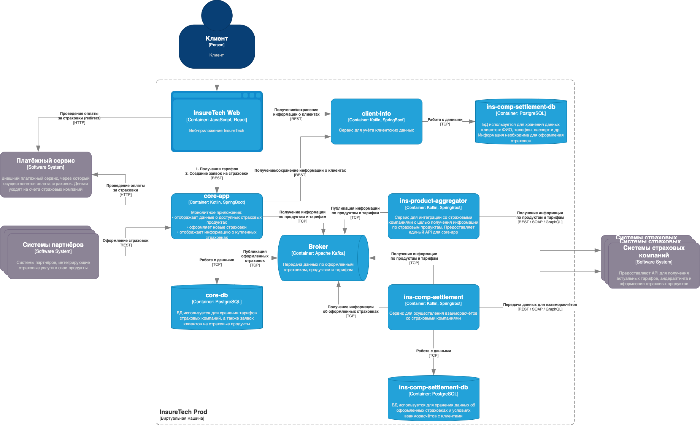

# Анализ приложения InsureTech

## Проблемы текущей архитектуры

1.  Сервис `ins-product-aggregator` синхронно обрабатывает запросы. Это значит, что при каждом добавлении новых страховых компаний, время обработки будет увеличиваться.

2. Рассинхрон данных между `core-app` и `ins-comp-settlement` из-за различной периодичности запросов.

3. Резкий скачек нагрузки у сервиса `ins-comp-settlement` в ночное время. С учетом роста компании, этот запрос будет занимать все больше и больше веремени в будущем.

4. Много взаимодействия, а следовательно большая связанность между сервисами `core-app`, `ins-comp-settlement` и `ins-product-aggregator`.

## Предлагаемые решения

Внедрение Event-Driven архитектура поможет решить проблемы:

- снижение нагрузки за счет равномерной обработки данные не большими порциями, а по мере поступления
- своевременное обновление данных
- снизит связность компонентов

Брокер сообщений поможет сервису `ins-comp-settlement` получать информацию об оформленные страховках из `core-app` сразу, а не раз в сутки.
В сервис `ins-product-aggregator` нужно внести изменения, чтобы он самостоятельно опраживал внешние сервисы через заданное время. Соответственно, через это время будут обновляться локальные реплики `core-app` и `ins-comp-settlement`, а они больше не будут опрашивать `ins-product-aggregator` и ждать от него ответа. Это так же снизит количество ошибок и система будет намного стабильней.

Т.к. `ins-comp-settlement` занимается взаиморасчетами и передает эти данные в стороние страховые компании, то важно, чтобы данный сервис точно получил сообщение об оформленной страховке и только один раз. Для обеспечения этого, на стороне `core-app` можно применить паттерн *Transactional outbox*.

## Итоговая схема

