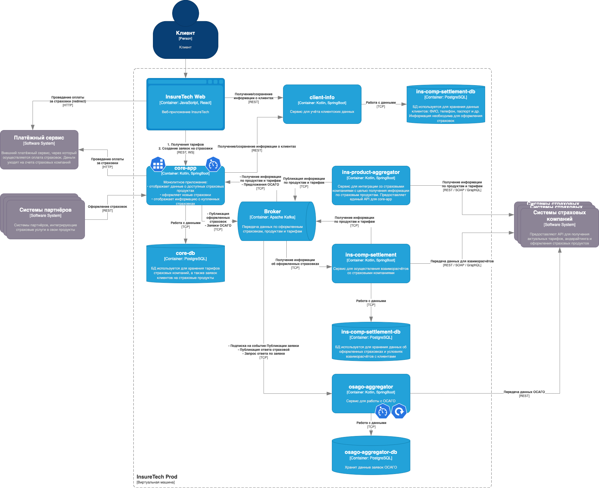

## Изменения в схеме

- Добавлен `osago-aggregator` со своей базой данных
- Между `core-app` и web-приложением добавлен websocket, чтобы видеть в режиме реального времени предложения от страховых

## Доработки функционала

1. Т.к. пользователь в течении 60 секунд ожидает решения от страховой, то можно было бы реализовать Rate Limiter на стороне `core-app`. Лимитер будет блокировать можественные запросы от пользователей, чтобы они не могли параллельно спамить заявками.

2. На стороне `osago-aggregator` необходимо реализовать retry-механизм, который будет опрашивать страховые комании. И добавить timeout, после которого будет сообщено, что предложения по завке отсутствуют.

3. Необходимо предусмотреть разрыв сокет соединения, например перезагрузка страницы. В этом случае, открывается новое сокет соединение, а `core-app` отправляет запрос в брокер для `osago-aggregator`, чтобы повторно получить список предложений.

## Итоговая схема

